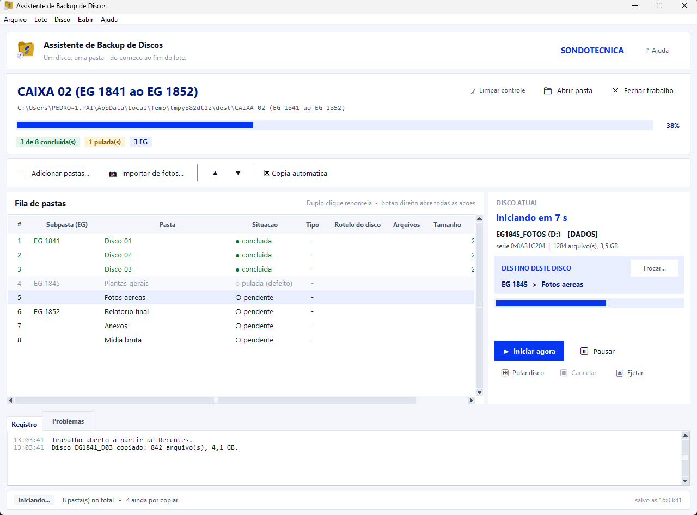
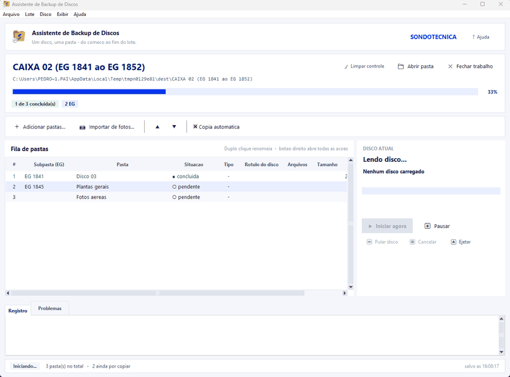
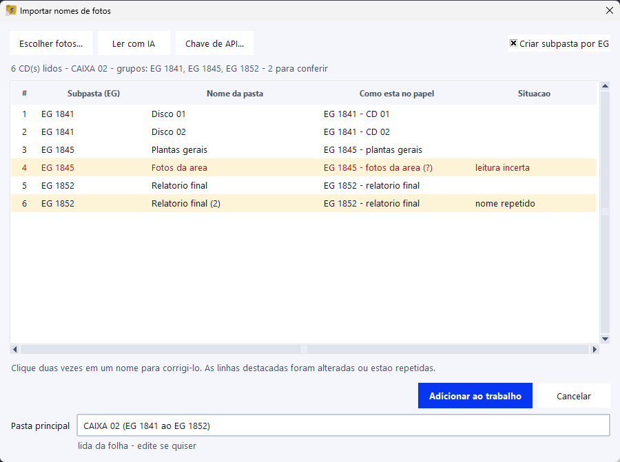
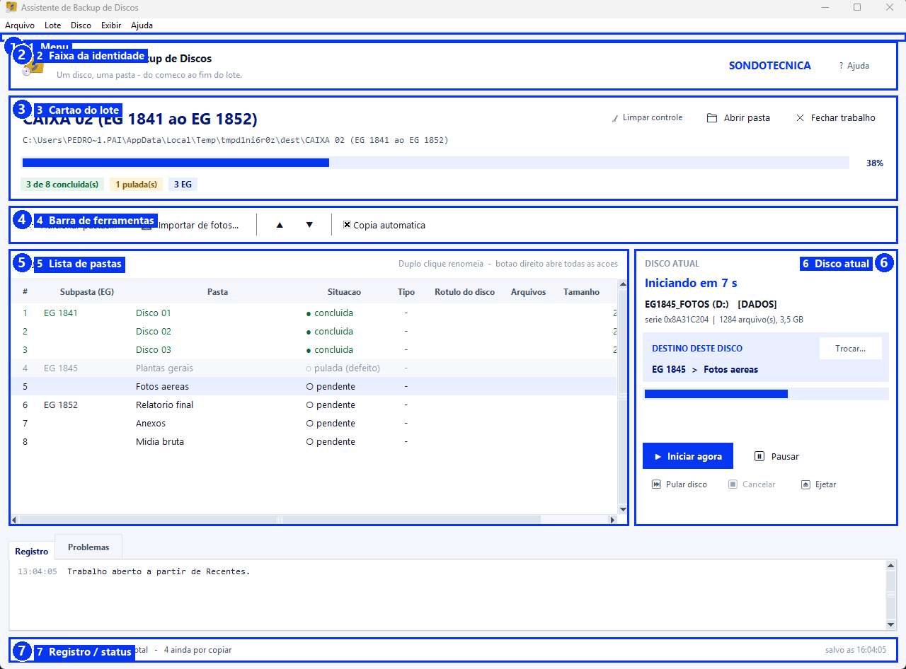
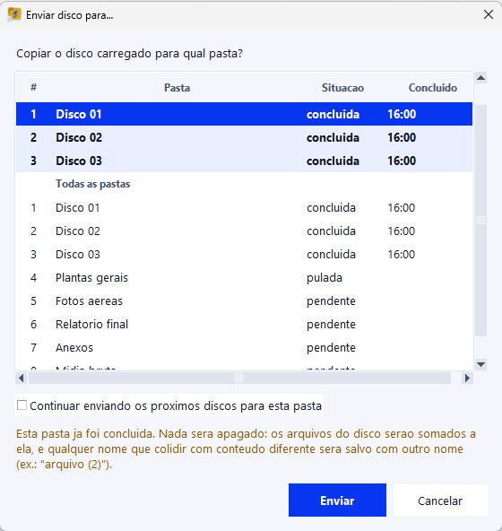
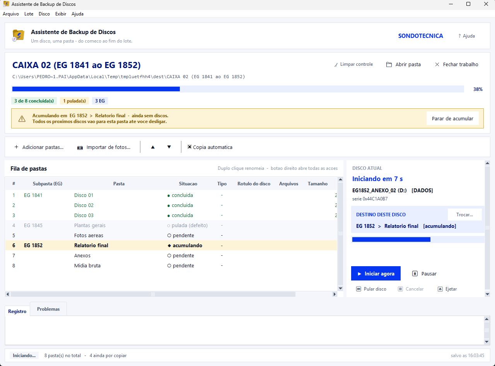
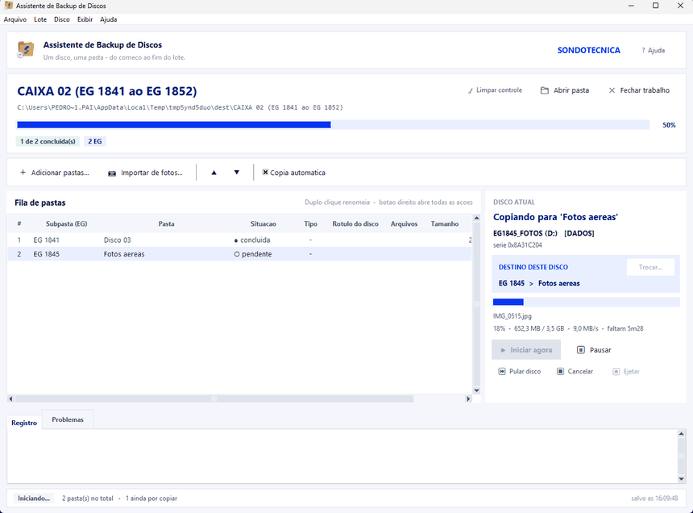
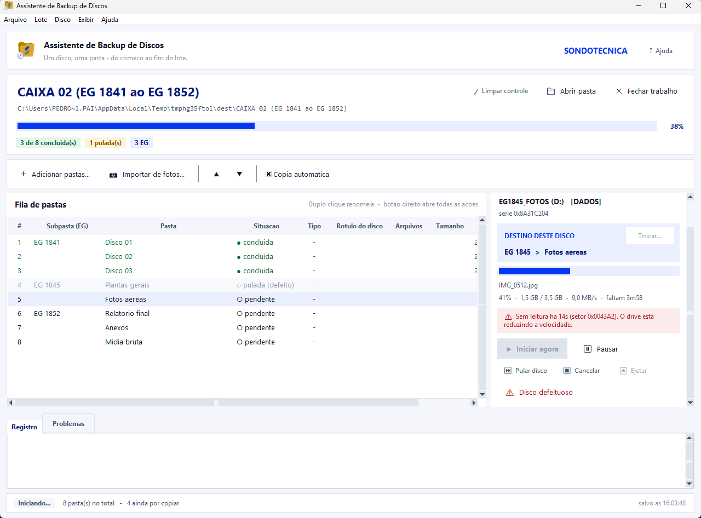
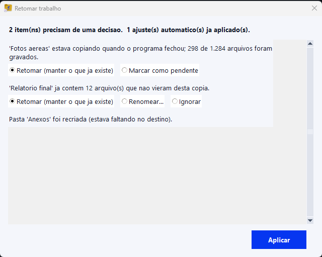
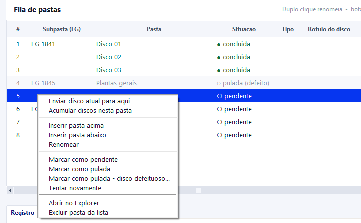

# backupov2 — Assistente de Backup de Discos

Copia um lote inteiro de CDs e DVDs para pastas organizadas, um disco por
pasta, quase sem você precisar tocar no computador. Você insere um disco, ele
identifica, cria a pasta certa, copia, confere, ejeta e fica esperando o
próximo. Seu trabalho vira: trocar os discos.

E quando algo sai do roteiro — disco riscado, disco fora de ordem, um
conjunto que veio em cinco partes, a rede caindo no meio — existe um caminho
claro para cada caso, sem perder nada do que já foi copiado.

**Só vai usar em outro computador, sem Python?** `.\build.ps1` gera um
executável para Windows que não precisa de nada instalado — veja
[Gerando o executável](#gerando-o-executável).



*A janela principal com um trabalho em andamento: o cartão do lote, a fila de pastas e o painel do disco atual.*

---

## Sumário

- [Instalação](#instalação)
- [Guia rápido: seu primeiro lote](#guia-rápido-seu-primeiro-lote)
- [Montando a lista de pastas](#montando-a-lista-de-pastas)
- [Conhecendo a tela](#conhecendo-a-tela)
- [O ciclo de um disco](#o-ciclo-de-um-disco)
- [Situações do dia a dia](#situações-do-dia-a-dia)
- [Referência rápida](#referência-rápida)
- [O que o programa nunca faz](#o-que-o-programa-nunca-faz)
- [Requisitos](#requisitos)
- [Limitações conhecidas](#limitações-conhecidas)
- [Linha de comando](#linha-de-comando)
- [Gerando o executável](#gerando-o-executável)
- [Para desenvolvedores](#para-desenvolvedores)

---

## Instalação

Não há nada para instalar. Precisa de Windows 10 ou 11 e Python 3.11 ou mais
novo — o Tkinter, que desenha a interface, já vem junto na instalação padrão
do Python para Windows.

```powershell
python run.pyw
```

Ou dê um duplo clique em `run.pyw` no Explorer. Se quiser um atalho na área
de trabalho, aponte para esse mesmo arquivo.

Para usar numa máquina que não tem Python, veja
[Gerando o executável](#gerando-o-executável).

Com o programa aberto, `F1` (ou **Ajuda > Ajuda e guias**) traz uma versão
curta deste manual, por situação, sem sair da janela. **Ajuda > Sobre o
programa** mostra a versão e as tecnologias em uso.

---

## Guia rápido: seu primeiro lote

O caminho mais curto, do zero até o primeiro disco copiado.

1. **Escolha o Destino.** Clique em **Procurar...** e aponte para a pasta
   onde o backup será gravado (normalmente um compartilhamento de rede).
2. **Dê um nome ao lote** no campo *Pasta do lote* — por exemplo
   `CAIXA 02 (EG 1841 ao EG 1852)`. É a pasta principal que vai conter todas
   as outras.
3. **Criar trabalho.** Abre uma janela para você colar a lista de nomes das
   pastas, um por linha, na ordem em que os discos serão inseridos.
4. **Insira o primeiro disco.** Em poucos segundos ele aparece no painel da
   direita, com uma contagem regressiva de 10 segundos.
5. **Espere ou clique em Iniciar agora.** A cópia começa, a barra anda, e ao
   terminar a bandeja abre sozinha.
6. **Troque o disco** e repita. A lista avança sozinha para a próxima pasta.
7. **Ao terminar o lote**, clique em **Fechar trabalho** para liberar a tela
   para o próximo.



*O ciclo de um disco: detecção, contagem regressiva, cópia até 100% e o aviso para remover o disco.*

Se você tem a folha do protocolo de entrega em mãos, pule os passos 2 e 3 e
use a importação por foto — a seção seguinte explica.

---

## Montando a lista de pastas

Existem dois jeitos de dizer ao programa quais pastas criar e em que ordem.

### Digitando os nomes

**Criar trabalho** (ou, com um trabalho já aberto, **+ Adicionar pastas...**)
abre uma caixa de texto simples. Cole ou digite um nome por linha, na ordem
dos discos:

```
ABG-DI-8963-GI-19 R0
ABG-DI-8963-GI-18 R0
ABG-DI-8963-GI-18 R1
```

Nomes inválidos no Windows são recusados na hora, com a explicação do
motivo — nada de descobrir o problema só na hora de gravar.

### Lendo a folha do protocolo por foto

Se o lote vem acompanhado do **PROTOCOLO DE ENTREGA DE MATERIAL DE MÍDIA**,
fotografe as páginas com o celular e deixe o programa transcrever.

1. Escolha apenas a pasta de **Destino** — mais nada.
2. **Importar de fotos...** → **Escolher fotos...** → **Ler com IA**.
3. Confira a tabela de revisão e clique em **Adicionar ao trabalho**.

A folha descreve o lote inteiro, então ela também fornece o nome da pasta
principal: a linha da caixa vira a sugestão, e você só edita se quiser. Por
isso o botão funciona **sem nenhum trabalho aberto** — não é preciso digitar
nada antes.



*A revisão depois da leitura por foto: nomes propostos, o que estava escrito no papel, e o que merece conferência.*

**Nada entra no trabalho sem você ver antes.** A tabela mostra, lado a lado,
o nome proposto e como está escrito no papel, sinalizando o que merece
atenção:

| Sinalização | O que significa |
|---|---|
| `caractere invalido no Windows: /` | `... R1 (1/3)` virou `... R1 (1-3)`, porque a barra é proibida em nomes de pasta |
| `nome repetido na folha (2o)` | o mesmo código aparece duas vezes no mesmo EG; como são dois CDs diferentes, o segundo virou `... (2)` em vez de ser descartado |
| `leitura incerta` | o próprio modelo avisou que não teve certeza daquela linha |

Clique duas vezes em qualquer nome para corrigi-lo antes de adicionar. O
texto original do papel fica guardado no trabalho, então dá para conferir
depois o que estava escrito, mesmo que você tenha editado o nome.

**A estrutura criada tem os três níveis da folha:**

```
CAIXA 02 (EG 1841 ao EG 1852)/
  EG 1841 (BENGUELA - ABG)/
      ABG-DI-8963-GI-19 R0/
      ABG-DI-8963-GI-18 R0/
  EG 1852 (LUANDA - ALU-3)/
      ALU-3-DI-1852-SD-03/
```

Desmarque **Criar subpasta por EG** se preferir tudo direto na pasta
principal, sem o nível do meio.

### A chave do Gemini

Na primeira vez, clique em **Chave de API...** e cole a chave. Ela fica só
neste computador, em `%LOCALAPPDATA%\backupov2\config.json`, e **nunca** é
escrita no trabalho nem copiada para a pasta de backup. Como alternativa,
defina a variável de ambiente `GEMINI_API_KEY` antes de abrir o programa.

---

## Conhecendo a tela



*As sete regiões da janela: menu, identidade, cartão do lote, barra de ferramentas, lista de pastas, disco atual e status.*

**1. O menu** reúne tudo o que o programa faz, inclusive o que também tem
botão. É por onde se descobre o programa sem precisar adivinhar onde clicar:

| Menu | O que tem dentro |
|---|---|
| **Arquivo** | novo trabalho, abrir, recentes, fechar, abrir a pasta do lote, limpar arquivos de controle, sair |
| **Lote** | adicionar pastas, importar de fotos, mover, renomear, excluir, abrir a pasta selecionada, cópia automática |
| **Disco** | iniciar, pular, pausar/retomar, cancelar, ejetar, enviar para outra pasta, marcar como defeituoso |
| **Exibir** | mostrar ou esconder o painel de registro, limpar o registro, copiar o registro |
| **Ajuda** | os guias curtos (F1), atalhos de teclado, o README e o **Sobre** |

Os itens que só fazem sentido com um trabalho aberto ficam apagados
enquanto não há nenhum.

**2. A faixa da identidade** mostra o nome do programa e o botão **Ajuda**,
que abre os guias curtos — os mesmos de `F1`.

**3. O cartão do lote** responde à pergunta mais importante: *qual lote estou
preenchendo agora?* Mostra o nome do lote em destaque, o caminho completo
logo abaixo (clicável, abre no Explorer), a barra de progresso com a
porcentagem e as contagens em etiquetas: concluídas, com falha, puladas e
quantos EG. À direita, **Limpar controle**, **Abrir pasta** e **Fechar
trabalho**.

Sem nenhum trabalho aberto esse cartão dá lugar ao cartão **Comece um
trabalho**, com os dois campos numerados na ordem em que se preenchem e os
quatro jeitos de começar: criar, abrir, recentes ou importar de fotos. Os
dois nunca aparecem juntos — o que está na tela é sempre o que dá para
fazer agora.

**4. A barra de ferramentas** tem **＋ Adicionar pastas...**,
**Importar de fotos...**, as setas `▲` `▼` que reordenam a pasta
selecionada, e a chave **Copia automatica**, que liga e desliga a contagem
regressiva. Passar o mouse sobre qualquer botão explica o que ele faz e
mostra o atalho.

**5. A lista de pastas** é o plano do lote. Cada linha é um disco. O EG
aparece só na linha em que muda, e cada EG ganha um fundo alternado, então
dá para ver de relance onde um grupo termina e o outro começa. A linha da
**próxima pasta pendente** fica destacada em azul.

A coluna *Situacao* traz um símbolo antes da palavra — `●` concluída,
`○` pendente, `◐` copiando, `◌` pulada, `✕` falhou, `◆` acumulando — para a
situação não depender só da cor. As cores reforçam: verde é concluída,
âmbar é concluída mas merece conferência, vermelho é falhou, cinza é pulada,
negrito é a que está sendo copiada agora. Na coluna *Arquivos*, um `(!3)` ao
lado do número significa que três arquivos daquele disco não puderam ser
lidos.

**A lista continua editável durante a cópia.** Só a linha que está sendo
gravada naquele instante fica protegida. Você pode renomear, reordenar,
inserir e excluir pastas com o lote rodando.

**6. O painel do disco atual** troca de conteúdo conforme o momento: sem
disco, contando regressivamente, copiando, ou esperando você remover o disco
concluído. A caixa azul **Destino deste disco** diz para onde o disco
carregado vai, com **Trocar...** ao lado para mudar de ideia. Abaixo, os
controles em duas linhas: o que faz o lote andar em cima, em destaque
(**Iniciar agora**, **Pausar**), e o que interrompe embaixo, discreto
(**Pular disco**, **Cancelar**, **Ejetar**). Os botões que não fazem sentido
no momento ficam apagados.

**7. Embaixo**, **Registro** guarda tudo que aconteceu, linha a linha, com a
hora de cada uma; **Problemas** repete só os avisos e erros. A barra de
status na última linha mostra o estado da unidade, quantas pastas faltam e
quando o trabalho foi salvo pela última vez.

---

## O ciclo de um disco

Para cada disco inserido, sempre as mesmas etapas:

**Detecção.** O rótulo, o número de série e o tipo são lidos assim que o
disco assenta. O programa espera duas leituras iguais seguidas antes de
agir, porque o Windows leva de 1 a 3 segundos para montar um disco e agir
cedo demais produz leituras fantasma.

**Contagem regressiva de 10 segundos.** O painel mostra o disco, a pasta de
destino, o tamanho e o espaço livre. É a sua janela para intervir: **Iniciar
agora**, **Pular disco**, **Enviar para...** ou **Pausar**. Se preferir que
nada comece sozinho, desligue **Copia automatica** — aí a cópia só começa
quando você clicar em **Iniciar agora**.

**Cópia**, com barra de progresso, velocidade e tempo restante. O progresso
anda também *dentro* de arquivos grandes, então um ISO de 4 GB não fica
parado em 0% até terminar.

**Ejeção automática** e espera até o disco sair fisicamente da bandeja,
antes de aceitar o próximo. Se a bandeja não abrir — acontece com gavetas
USB —, o programa avisa para remover à mão e segue normalmente.

---

## Situações do dia a dia

Esta é a parte que vale ler antes de começar: o que fazer quando o lote sai
do roteiro.

### O disco na mão não é o próximo da fila

Clique em **Enviar para...** durante a contagem. Abre um seletor com duas
partes: **Usadas recentemente** (as últimas pastas concluídas, em destaque
no topo) e **Todas as pastas**, na ordem do trabalho.



*Escolhendo para qual pasta o disco carregado vai — as usadas recentemente aparecem destacadas no topo.*

A contagem **pausa** assim que o seletor abre — não há risco de a cópia
começar sozinha enquanto você procura. Ao confirmar, a cópia começa na hora,
sem nova contagem: escolher já foi a confirmação. Cancelar volta exatamente
para onde você estava.

Enviar um disco para uma pasta que já tem conteúdo **sempre soma, nunca
substitui**.

### Um conjunto veio em vários discos

Quando um único conjunto ocupa três, quatro ou dez discos, não faz sentido
criar uma pasta para cada um. Marque a pasta para **acumular** e ela passa a
receber todos os discos seguintes, um atrás do outro, até você desligar.

Ligue por um dos dois caminhos:

- botão direito na pasta, na lista, e **Acumular discos nesta pasta**;
- no seletor **Enviar para...**, marque *Continuar enviando os próximos
  discos para esta pasta* antes de confirmar.



*Acumulando discos: a faixa âmbar avisa que todo disco vai para a mesma pasta até ser desligada.*

Enquanto está ligado, uma faixa âmbar no topo diz em qual pasta está
acumulando e quantos discos já entraram, com o botão **Parar de acumular** à
mão. A linha na lista fica âmbar e a situação mostra `acumulando (3)` em vez
de `concluida`, porque a pasta não está concluída — está esperando o
próximo disco.

Detalhes que importam:

- **a ordem da lista não muda.** Desligar devolve tudo ao que era: o próximo
  disco volta para a primeira pasta pendente.
- **cada disco entra no registro separadamente**, com rótulo, número de
  série e quanto contribuiu — o histórico de um não apaga o do anterior.
- **o lote não se declara concluído** enquanto uma pasta estiver acumulando.
- **reinserir um disco que já entrou continua avisando**, porque a
  verificação olha todos os discos da pasta, não só o último.
- arquivos de mesmo nome vindos de discos diferentes (`AUTORUN.INF` e
  companhia) são salvos como `arquivo (2).ext`, sem apagar nada e sem marcar
  a pasta para conferência — aqui isso é esperado, não é problema.

Só uma pasta acumula por vez. Ao ligar numa segunda, o programa pede
confirmação antes de transferir.

### Preciso parar no meio de uma cópia

Três botões, e a diferença entre eles é só o que acontece com o disco:

| Botão | O que faz | O disco |
|---|---|---|
| **Pausar** | congela a transferência onde está; **Retomar** continua do mesmo ponto | fica na bandeja |
| **Pular disco** | para a transferência e ejeta | volta para a sua mão |
| **Cancelar** | para a transferência | fica na bandeja, para tentar de novo |



*Pausar segura a cópia sem perder o progresso; o botão vira Retomar até você continuar.*

**Nada do que já foi gravado se perde em nenhum dos três casos.** A pasta
volta para *pendente*, os arquivos copiados continuam lá, e reinserir o
mesmo disco retoma de onde parou — arquivos idênticos não são regravados.
Pular também **não consome a pasta**: ela continua sendo a próxima da fila.

A pausa vale entre arquivos e também no meio de um arquivo grande, então um
ISO de 4 GB para em segundos. O tempo parado não entra na conta da
velocidade: uma pausa de dez minutos não faz o programa relatar que a rede
ficou lenta.

O botão **Ejetar** fica apagado durante a cópia, porque a unidade está em
uso. **Pular disco** é o caminho seguro para abrir a bandeja — ele espera a
transferência soltar o drive antes de ejetar.

### O disco está riscado e a cópia não anda

**Um arquivo ilegível não para o disco.** São três tentativas, depois ele é
pulado e registrado, e a cópia segue. Para um risco isolado é exatamente o
comportamento certo, e por isso nenhum botão novo aparece nesse caso.

Quando o problema é o **disco**, e não um arquivo, aparece um aviso vermelho
no painel e, junto dele, o botão **Disco defeituoso**. Isso acontece em duas
situações:

- **três ou mais arquivos** não puderam ser lidos; ou
- a unidade **parou de responder** por 45 segundos — sem erro, sem
  progresso, sem nada.



*Um disco começando a falhar: o aviso e o botão Disco defeituoso aparecem só quando fazem sentido.*

Nada acontece sozinho: um disco lento que ainda vai terminar é melhor do que
um disco abandonado por palpite. A decisão é sua.

Ao confirmar **Disco defeituoso**, a transferência para, a pasta é marcada
como falhou, **os arquivos que deram certo continuam lá**, um relatório é
gravado dentro da pasta e o disco é ejetado. O próximo disco vai para a
próxima pasta pendente.

O relatório, `_DISCO_COM_DEFEITO.txt`, fica dentro da pasta do disco:

```
DISCO COM DEFEITO
============================================================

Este disco foi marcado como defeituoso durante a copia.
O CONTEUDO DESTA PASTA ESTA INCOMPLETO.

Disco.......................: PROJ2019_07 (D:)
Numero de serie.............: 0x499602D2
Marcado em..................: 2026-09-18 14:32:05
Motivo......................: 4 arquivo(s) nao puderam ser lidos

Arquivos copiados com sucesso: 812
Arquivos que falharam........: 4

ARQUIVOS QUE NAO PUDERAM SER LIDOS
------------------------------------------------------------
VIDEO_TS\VTS_01_3.VOB
    [WinError 23] Data error (cyclic redundancy check)
```

Ele descreve os dados, não a ferramenta — por isso **não** é apagado pela
limpeza de arquivos de controle. Remova à mão quando o disco for recuperado
ou substituído.

**Se a unidade travar de vez**, o programa espera 10 segundos pela parada e
então abandona a leitura em vez de ficar preso a ela: a pasta é marcada, o
relatório diz que a unidade parou de responder, e o lote segue. Se a leitura
travada voltar depois disso, o resultado é ignorado — ela não reabre uma
pasta que você já deu por encerrada.

### O disco chegou quebrado e nem dá para tentar

Disco trincado, ou que o leitor simplesmente não reconhece. Não há cópia
para interromper, então a ação está na lista: **botão direito na pasta** e
**Marcar como pulada - disco defeituoso...**.

Abre uma janela para confirmar e, se quiser, escrever uma **observação**
("disco trincado ao meio", "não é reconhecido pelo leitor"). Vale preencher:
um protocolo de entrega precisa ser respondido dizendo qual disco não pôde
ser lido e por quê, e ninguém lembra do detalhe duas semanas depois.


*Marcando uma pasta como pulada por disco defeituoso, com uma observação para o relatório.*

A pasta fica **pulada (defeito)** na lista — não *falhou*, porque ela não
foi tentada e sim descartada de propósito — e recebe o mesmo
`_DISCO_COM_DEFEITO.txt`, que nesse caso diz que nenhum arquivo foi copiado
e traz a sua observação. Nada que já esteja na pasta é apagado.

A opção é recusada enquanto aquela pasta estiver sendo copiada. Nesse caso
existe uma transferência de verdade para parar antes, e quem faz isso é o
botão **Disco defeituoso** do painel.

### O disco foi recuperado depois

**Tentar novamente**, no menu de contexto da lista: a pasta volta a pendente
e a nova cópia aproveita o que já está lá. Quando terminar com sucesso, o
`_DISCO_COM_DEFEITO.txt` é **apagado automaticamente** — senão a pasta
ficaria se contradizendo, cheia de arquivos e com um bilhete dentro dizendo
que nada pôde ser copiado.

### Inseri o mesmo disco duas vezes

O programa reconhece pelo número de série (ou, na falta dele, pelo rótulo) e
avisa em vez de copiar de novo, dizendo para qual pasta aquele disco já foi
e quando. Você escolhe entre copiar mesmo assim para a próxima pasta
pendente ou pular.

É um aviso, nunca um bloqueio: números de série de CD são às vezes
sintéticos e dois discos gravados no mesmo segundo podem colidir.

### Fechei o programa no meio do lote

Nada se perde. Reabra o trabalho por **Abrir...** ou **Recentes** e o
programa compara o que estava salvo com o que existe de fato no disco,
mostrando uma janela de reconciliação quando algo precisa da sua decisão.



*Reabrindo um trabalho: o que a reconciliação encontrou, e o que já foi ajustado sozinho.*

| Situação | O que acontece |
|---|---|
| Pasta estava "copiando" quando o programa fechou | volta sozinha para pendente; reinserir o disco retoma dos arquivos que faltam |
| Pasta pendente, mas já tem arquivos dentro | pergunta: retomar aproveitando, sobrescrever, marcar como concluída, ou renomear |
| Pasta concluída, mas sumiu ou está vazia | pergunta antes de desfazer — pode ter sido movida de propósito |
| Pasta concluída com contagem de arquivos diferente | fica marcada para conferência, sem mudar o status |
| Destino de rede fora do ar | avisa e não tenta criar nada até a unidade voltar |

Só os ajustes mecânicos acontecem sozinhos. O resto sempre pergunta.

### Terminei o lote e vou começar outro

**Fechar trabalho**, no cartão do lote, ou `Ctrl+W`. A lista esvazia, o
cartão **Comece um trabalho** volta e **Criar trabalho** fica disponível de
novo. Não apaga nada:
o trabalho continua salvo e aparece em **Recentes**. O campo *Destino*
continua preenchido, já que o próximo lote costuma ir para o mesmo lugar.

### Vou entregar a pasta para outra pessoa

**Limpar controle**, no cartão do lote (ou **Arquivo > Limpar arquivos de
controle...**), remove da pasta do lote os arquivos que o próprio programa
escreveu: `_backupov2-job.json`, o `.bak` de segurança, um
`.tmp` perdido e o registro.

Só esses nomes fixos são apagados. As pastas dos discos, tudo que foi
copiado e os relatórios de defeito não são tocados, e nenhuma varredura
recursiva acontece. A cópia local do trabalho é mantida, então ele continua
abrível em **Recentes** mesmo depois da limpeza.

---

## Referência rápida

### Colunas da lista

| Coluna | O que mostra |
|---|---|
| `#` | posição na fila |
| `Subpasta (EG)` | o grupo, exibido só na linha em que muda |
| `Pasta` | o nome da pasta do disco (duplo clique renomeia) |
| `Situacao` | pendente, copiando, concluida, pulada, falhou, ou `acumulando (N)` |
| `Tipo` | dados ou audio |
| `Rotulo do disco` | o rótulo do disco que foi realmente gravado ali |
| `Arquivos` | quantos foram copiados; `(!3)` indica três que falharam |
| `Tamanho` | total gravado |
| `Concluido` | data e hora do término |

As colunas podem ser arrastadas para a largura que você quiser e **ficam
assim**. Quando a soma passa da largura da janela, a barra de rolagem
horizontal embaixo da tabela leva até o resto.

### Menu de contexto da lista

Botão direito em qualquer linha:

- **Enviar disco atual para aqui** — redireciona o disco carregado
- **Acumular discos nesta pasta** / **Parar de acumular nesta pasta**
- **Inserir pasta acima** / **Inserir pasta abaixo**
- **Renomear**
- **Marcar como pendente** / **Marcar como pulada**
- **Marcar como pulada - disco defeituoso...**
- **Tentar novamente**
- **Abrir no Explorer**
- **Excluir pasta da lista**



*O menu de contexto da lista, com todas as ações disponíveis para a pasta selecionada.*

### Quando cada botão do painel fica ativo

| Momento | Botões disponíveis |
|---|---|
| Aguardando disco | Pausar, Ejetar |
| Contagem regressiva | Iniciar agora, Pular disco, Pausar, Ejetar, Enviar para... |
| Copiando | Pular disco, Pausar, Cancelar |
| Copiando, pausado | Pular disco, Retomar, Cancelar |
| Disco já copiado (duplicata) | Iniciar agora, Pular disco, Pausar, Ejetar, Enviar para... |
| Pausado, sem cópia | Pular disco, Retomar, Ejetar, Enviar para... |

**Disco defeituoso** aparece apenas quando a cópia atual dá sinais de
problema, e some quando o disco termina.

### Atalhos de teclado

| Tecla | Ação |
|---|---|
| `F1` | abrir a ajuda |
| `Espaço` | iniciar a cópia agora |
| `Esc` | cancelar a cópia em andamento |
| `Ctrl+P` | pausar ou retomar |
| `Ctrl+J` | ejetar |
| `Ctrl+D` | enviar o disco para outra pasta |
| `Ctrl+N` | novo trabalho |
| `Ctrl+O` | abrir trabalho |
| `Ctrl+W` | fechar o trabalho aberto |
| `Ctrl+E` | abrir a pasta do lote no Explorer |
| `Ctrl+Q` | sair |
| `Ctrl+Shift+A` | adicionar pastas |
| `Ctrl+I` | importar de fotos |
| `Alt+Cima` / `Alt+Baixo` | reordenar a pasta selecionada |
| `F2` ou duplo clique no nome | renomear a pasta |
| `Delete` | excluir a pasta selecionada da lista |

`Espaço` e `Delete` não disparam enquanto você está digitando num campo de
texto.

---

## O que o programa nunca faz

Estas são garantias, não intenções — cada uma delas tem teste automatizado.

- **Nunca sobrescreve um arquivo existente com conteúdo diferente.** O que
  chega é salvo como `arquivo (2).ext` e o original fica intocado. Um
  arquivo idêntico (mesmo tamanho e data) é reconhecido como já copiado e
  simplesmente pulado.
- **Nunca perde o que já foi copiado** ao pausar, pular, cancelar ou marcar
  um disco como defeituoso.
- **Nunca apaga dados seus.** A limpeza de arquivos de controle mexe apenas
  numa lista fixa de nomes que o próprio programa criou, na pasta do lote, e
  jamais de forma recursiva.
- **Nunca desiste de um disco inteiro por causa de um arquivo.** Um setor
  ilegível custa um arquivo, com registro do que falhou, não os outros 800.
- **Nunca marca como concluída uma pasta incompleta.** Falha vira falha, com
  relatório dentro da pasta dizendo exatamente o que faltou.
- **Nunca escreve sua chave de API** no arquivo do trabalho nem em qualquer
  lugar dentro da pasta de backup.
- **Nunca deixa o lote preso** num disco que não responde: depois de 10
  segundos ele abandona a leitura travada e segue.

O trabalho é gravado de forma atômica em dois lugares: `%LOCALAPPDATA%`, que
manda em caso de divergência, e `_backupov2-job.json` dentro da pasta do
lote, que torna a pasta autoexplicativa. O local vem primeiro porque um
arquivo que só existe no compartilhamento de rede não consegue registrar a
queda desse mesmo compartilhamento.

---

## Requisitos

- **Windows 10 ou 11** e **Python 3.11+** com Tkinter (padrão no instalador
  oficial do Python para Windows).
- **Uma unidade óptica.** Funciona com gravadoras USB externas; a ejeção por
  software é tratada como sugestão, com aviso para remover à mão quando a
  bandeja não obedece.
- **Opcional:** chave de API do Gemini, para importar nomes por foto. Sem
  ela, a digitação manual continua disponível.
- **Opcional:** `ffmpeg` com o dispositivo `libcdio`, para CDs de áudio (veja
  as limitações abaixo).

---

## Limitações conhecidas

- **CD de áudio ainda não é copiado.** Discos de áudio são detectados
  corretamente e marcados como pulados com um aviso claro, em vez de travar
  o programa ou serem confundidos com discos de dados. A ripagem para MP3
  está planejada.
- **Discos de modo misto** são tratados como discos de dados; a parte de
  áudio não é extraída.
- **Não gera imagens ISO.** O programa copia arquivos, não faz cópia bit a
  bit da mídia.
- **Um disco por vez.** Com várias unidades ópticas, elas são atendidas em
  ordem de letra, uma de cada vez — copiar duas ao mesmo tempo só dividiria
  a banda do mesmo compartilhamento de rede.

---

## Linha de comando

Úteis para conferir o ambiente ou trabalhar fora da interface:

```powershell
python -m backupov2.tools.drivecheck            # unidades, disco carregado, tipo
python -m backupov2.tools.drivecheck --eject    # abre a bandeja
python -m backupov2.tools.drivecheck --size     # mede o disco carregado

python -m backupov2.tools.jobdump "<caminho>\_backupov2-job.json"

python -m backupov2.tools.extract protocolo*.jpg
python -m backupov2.tools.extract --names-only *.jpg > nomes.txt
```

---

## Gerando o executável

Para rodar numa máquina sem Python instalado. Precisa do PyInstaller, uma
única vez:

```powershell
python -m pip install pyinstaller
```

Depois, na raiz do projeto:

```powershell
.\build.ps1
```

O script roda os testes primeiro e só empacota se todos passarem. O
resultado é a pasta **`dist\backupov2\`** — copie ela inteira para a outra
máquina e dê um duplo clique em `Assistente de Backup de Discos.exe` lá
dentro, ou crie um atalho apontando para ele. São cerca de 27 MB, e não
precisa de Python nem de instalação do outro lado.

Sem o script, o mesmo resultado sai de:

```powershell
python -m PyInstaller backupov2.spec --noconfirm --clean
```

### Uma pasta ou um arquivo só

| | `.\build.ps1` (padrão) | `.\build.ps1 -OneFile` |
|---|---|---|
| Resultado | pasta `dist\backupov2\` | um `.exe` em `dist\` |
| Tamanho | ~27 MB no total | ~11 MB |
| Início | imediato | 2 a 3 segundos (ele se descompacta a cada vez) |
| Para entregar | copiar a pasta, ou zipar | mandar um arquivo |
| Antivírus | raramente reclama | **frequentemente removido** |

A versão de arquivo único é mais cômoda de mandar por e-mail, mas o
bootloader do PyInstaller, sem assinatura digital, se descompactando numa
pasta temporária é um padrão que os antivírus corporativos tratam como
suspeito. **Neste computador o antivírus apagou o `.exe` de arquivo único
poucos segundos depois do build**, sem aviso — a pasta `dist\` simplesmente
ficou vazia. Por isso o padrão é a pasta.

Se precisar mesmo do arquivo único, os caminhos são, na ordem:

1. Pedir ao TI uma **exclusão** no antivírus para a pasta do projeto e para
   o destino onde o `.exe` vai ficar.
2. **Assinar digitalmente** o executável com um certificado de code signing
   da empresa — é o que resolve de verdade, inclusive no SmartScreen.
3. Entregar a pasta em vez do arquivo único.

Se o build terminar dizendo "o arquivo não está lá", é isso que aconteceu —
não é falha do PyInstaller.

### O que vai dentro

O programa é Python puro mais Tkinter, então o pacote não arrasta
dependências de terceiros. O que precisa estar lá e é fácil esquecer:

- **`backupov2/ui/assets/`** — o logotipo e o ícone da janela são lidos do
  disco em tempo de execução. O `.spec` os copia para o mesmo caminho
  relativo, e `theme._assets_dir()` procura primeiro em `sys._MEIPASS`.
- **`console=False`** — sem isso, uma janela de console preta fica aberta
  atrás da interface.
- **`email` e `http`** não podem entrar na lista de exclusões: parecem não
  ter uso, mas `urllib.request` importa os dois, e `vision.py` importa
  `urllib.request` logo na abertura. Excluí-los gera um `.exe` que compila
  sem reclamar e morre na primeira linha.

O ícone, o nome e a versão que aparecem em *Propriedades > Detalhes* saem do
próprio `backupov2.spec`. Ao subir a versão, mude `VERSION`, `filevers` e
`prodvers` lá, junto com `__version__` em `backupov2/__init__.py`.

---

## Para desenvolvedores

```powershell
python -m unittest discover -s tests -t . -v
```

409 testes, **nenhum deles exige uma unidade óptica de verdade**. O scanner,
o copiador, o ejetor e o relógio são injetados, então uma sessão inteira de
discos é reproduzida de forma determinística: inserir, pular, redirecionar,
duplicata, acumular vários discos numa pasta, pausar e pular no meio de uma
transferência, disco defeituoso, unidade travada, disco removido durante a
cópia, rede caindo, falha ao ejetar, fechar e retomar.

```
backupov2/
  core.py       validação de nomes, varredura e cópia (com política de erro)
  errors.py     taxonomia de erros do Windows -> política de retentativa
  winapi.py     TODO o ctypes: unidades, mídia, ejeção, caminhos longos
  media.py      MediaInfo, scanners real e falso, detecção do tipo de disco
  jobmodel.py   Job / DiscEntry / EntryDraft - o modelo de dados
  jobstore.py   gravação atômica, cópia local + portátil, recentes
  reconcile.py  compara o trabalho salvo com o que está no disco
  vision.py     leitura dos protocolos por foto (Gemini)
  runner.py     a máquina de estados da cópia automática, sem interface
  ui/           Tkinter: janela, lista, painel do disco, diálogos
    theme.py      paleta, tipografia e estilos ttk - a marca, num arquivo só
    app.py        a janela principal e o único ponto que toca widgets
    menubar.py    o menu do topo e o que fica ativo com um trabalho aberto
    guide.py      a janela de Ajuda e o Sobre
    widgets.py    cartão, etiqueta, dica de mouse, registro, editor de célula
  tools/        drivecheck, jobdump, extract
```

A interface toda tira cores, fontes e estilos de `ui/theme.py` — nenhum
outro arquivo escreve um código hexadecimal. Trocar a marca é editar aquele
arquivo, não caçar nove painéis.

Três regras verificadas automaticamente por `tests/test_layering.py`: nada
fora de `ui/` importa `tkinter`; nada fora de `winapi.py` importa `ctypes`;
nenhuma função de thread de trabalho toca a interface — o resultado volta
por uma fila que a thread principal consome.

**O detalhe que faz tudo funcionar:** não existe um índice de "disco atual"
em lugar nenhum. O próximo destino é sempre uma consulta derivada — a
primeira entrada ainda pendente, ou a pasta marcada para acumular. Pular,
redirecionar, reordenar e inserir no meio da execução saem de graça, porque
não há um ponteiro separado que possa discordar da lista.
